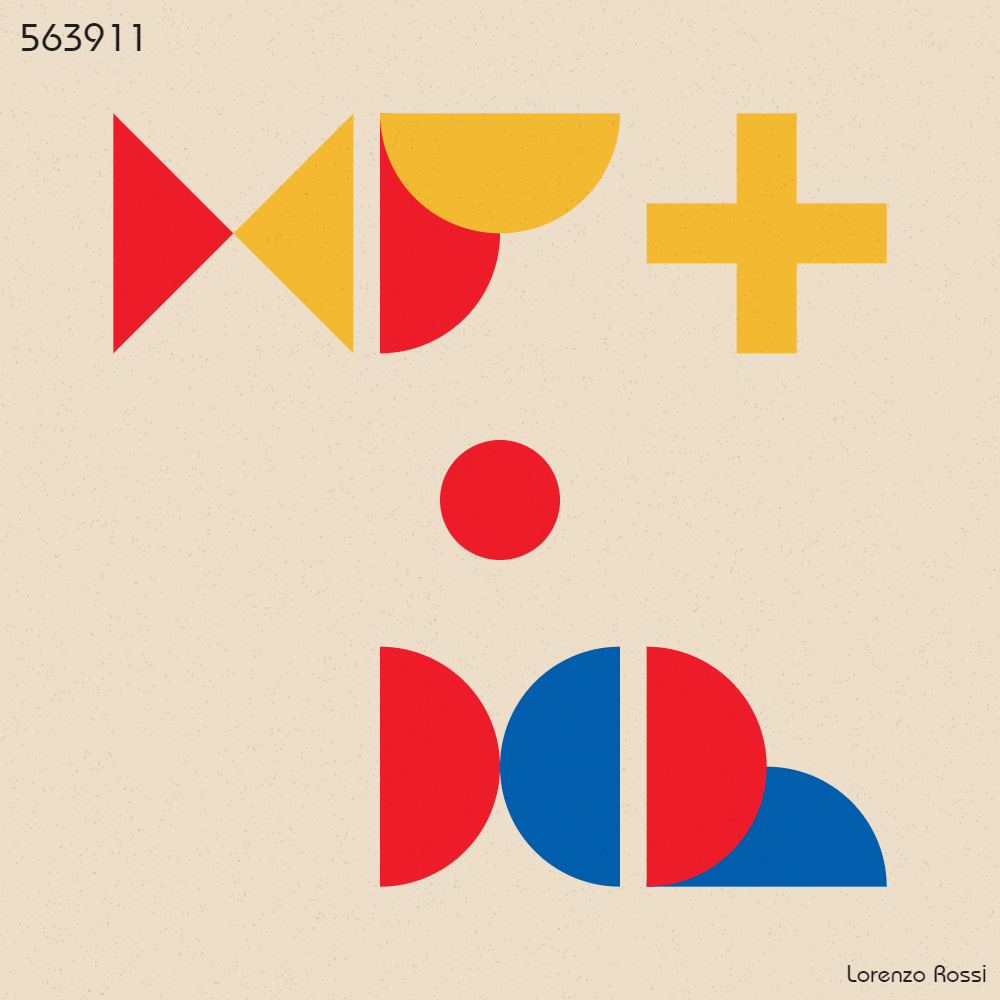
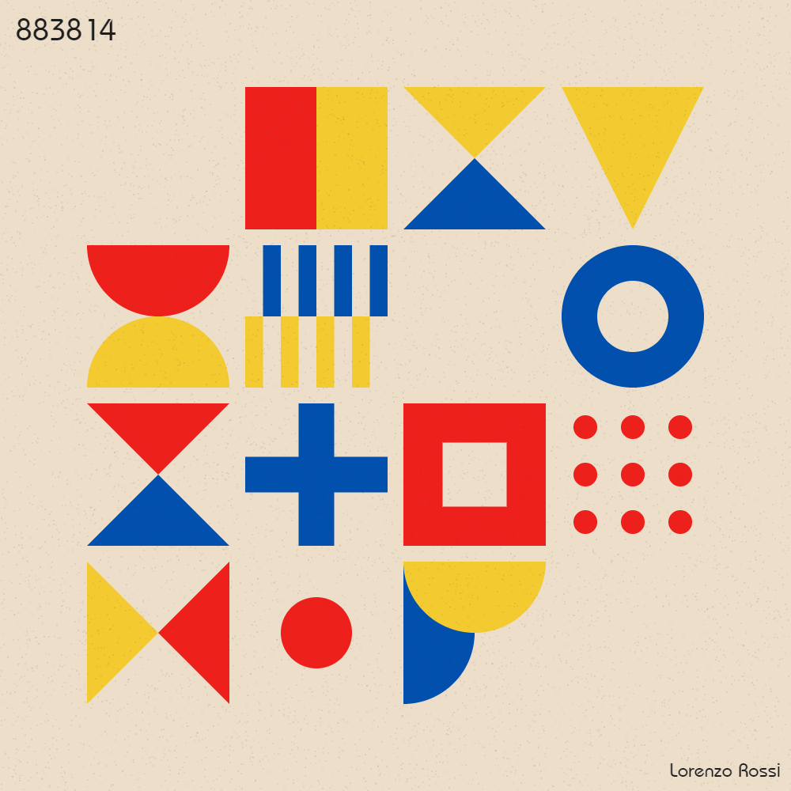
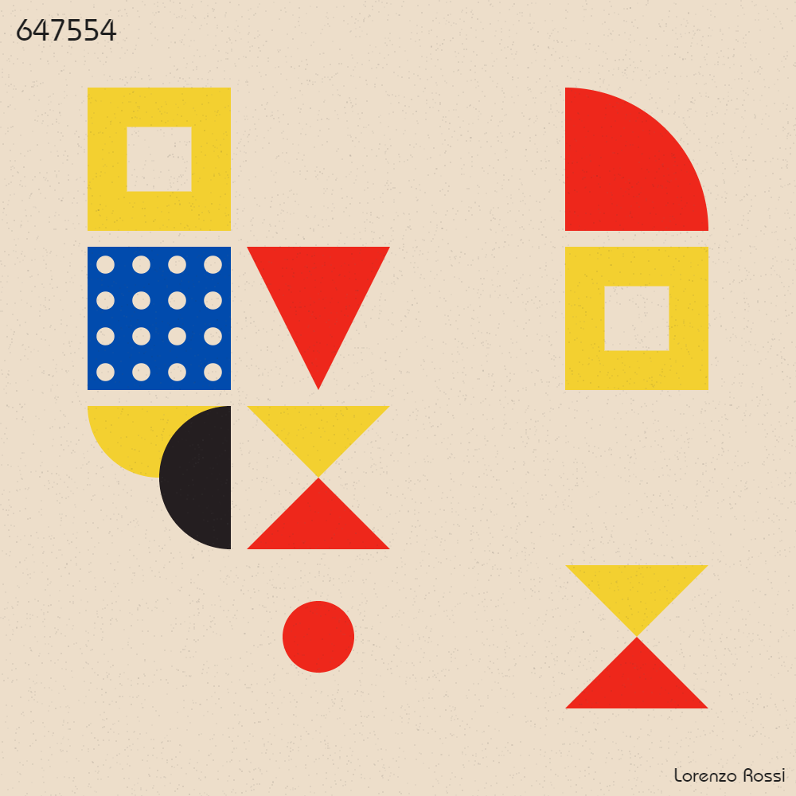
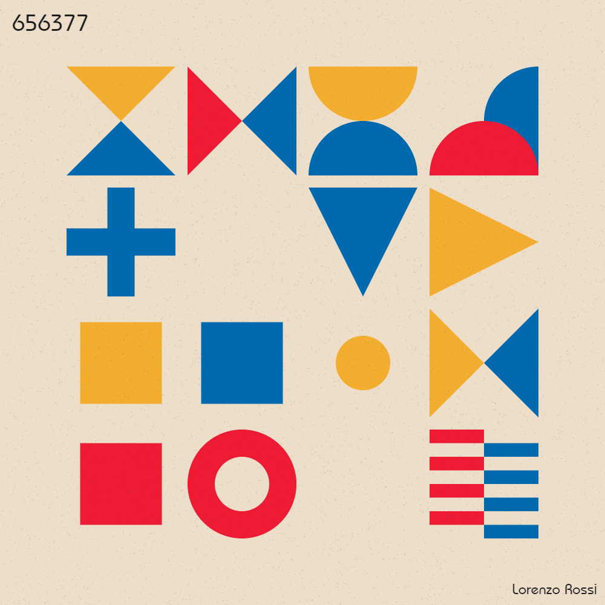
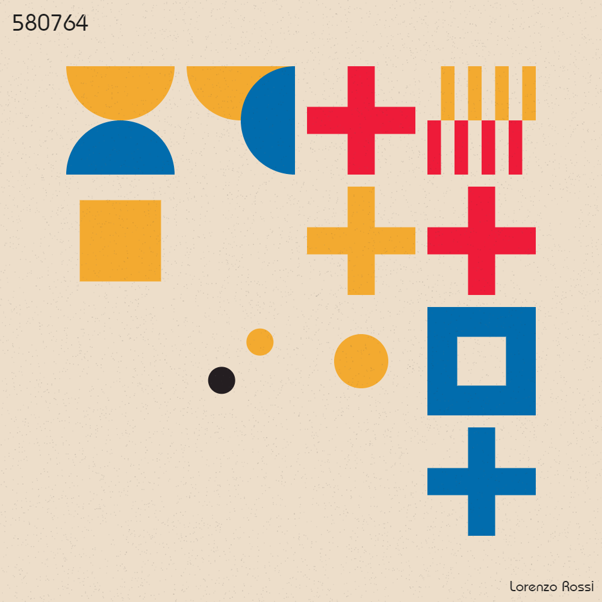

# Bauhaus time

Sometimes, I get obsessed to something, but just for a week or two. At this point of my life, I call this "my weekly obsession".

This week's lucky winner is *Bauhaus*, the famous (although short lived, sadly) german art movement born in the early 20s. I've always really liked this style (maybe I was influenced as a child? I do recall having a bauhaus themed blanked. Or was it a blanket with a silly joke on Bauhaus? I can't really remember.) In the past, I tried experimenting with this kind of style in another few projects, like [circle tiling](https://www.github.com/lorossi/circle-tiling) and [random mondrian](https://www.github.com/lorossi/random-mondrian).

 *But it was not enough.* How could that be enough, after all?

I tried to replicate what it was taught in that school, but using my style. I set myself **3 simple rules**:

1. **Simple colors** - *red, yellow and black.* Nothing less, nothing more. Each one has a different chanche of coming up on the final image, so you will rarely see black (but if you try enough, eventually you will find it).
1. **Repetitions** - every canvas is made by a grid with a random number of lines and columns, varying between 3 and 10. Each generated tile is occupied by an unique combination of shapes.
1. **Basic shapes** - each tile is filled by a randomly generated composition with one or two color. The script picks one of 17 random algorithm to fill the allotted space. As it happens with the colors, not every composition has the same probability of being picked. *There's also a not-so-small change of the tile being left empty.*

As I did in other scripts, I then added a bunch of tiny dark particles to give texture and some *old paper* effect, rotated by each tile by a small angle to give the illusion that each shape was hand drawn and... *voilà*, the script is served! The title is randomly generated, so you can say that every drawing is, in fact, unique.

Try it as much as you want, it's free! If you like any of the generated image, just press on the button to save it. Forever!

Also, if you are interested, be sure to check my [Instagram profile](https://www.instagram.com/lorossi97) where I post a lot of things that I do.

**DISCLAIMER** *I am not a designer, an art student, an artist, or one that has studied anything related to this topic. Please don't be offended by my project. Of course it's not really Bauhaus and I would never claim to be like Kandisky or Mondrian, just to name a few. But I had fun doing this. Feel free to leave a comment on my Instagram post or here on GitHub tho!*

## Try it here [lorenzoros.si/bauhaus-time](https://lorenzoros.si/bauhaus-time/)

## Output

*Bauhaus 3x3*

*Bauhaus 4x4*

*Bauhaus 5x5*

*Bauhaus 6x6*

*Bauhaus 8x8*

*Bauhaus 9x9*

## Credits

This project is distributed under Attribution 4.0 International (CC BY 4.0) license.
